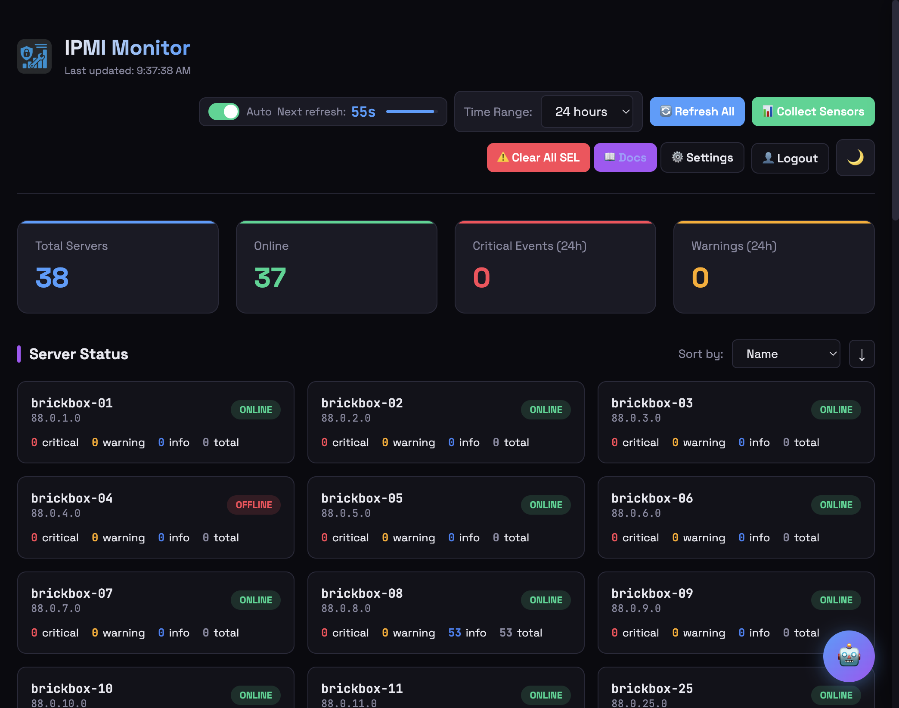
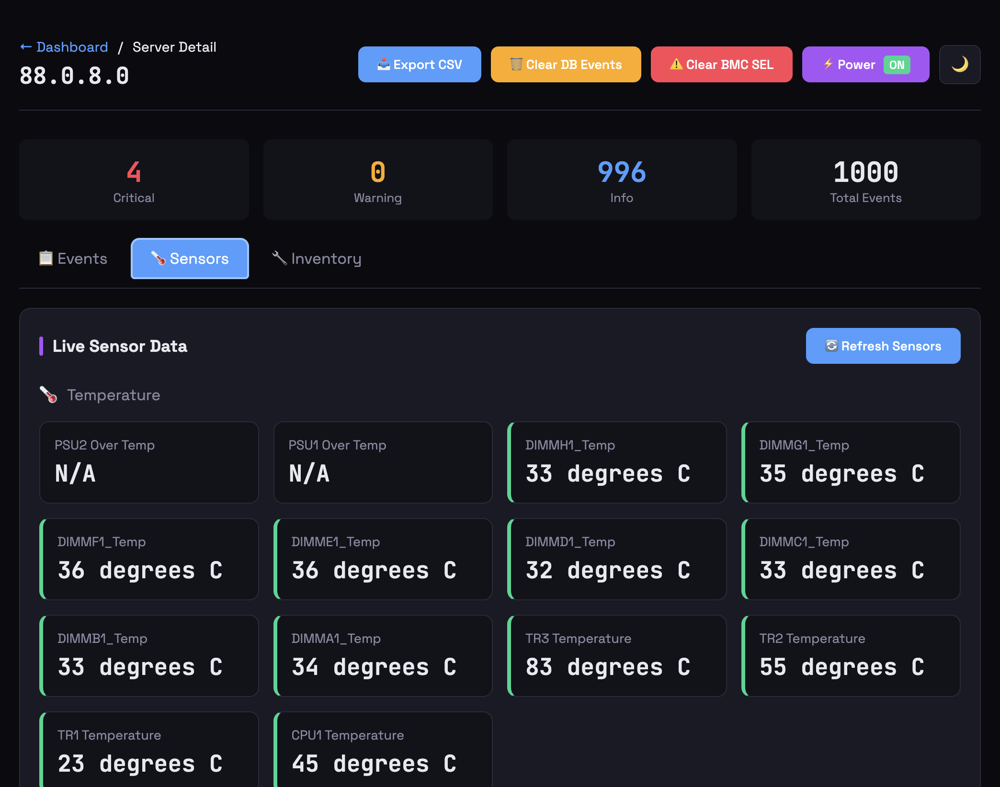
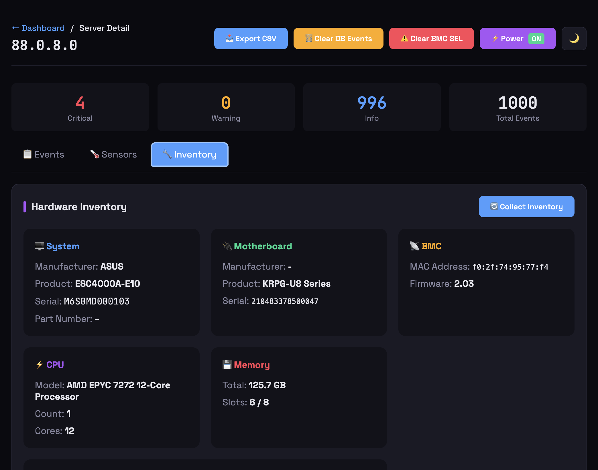
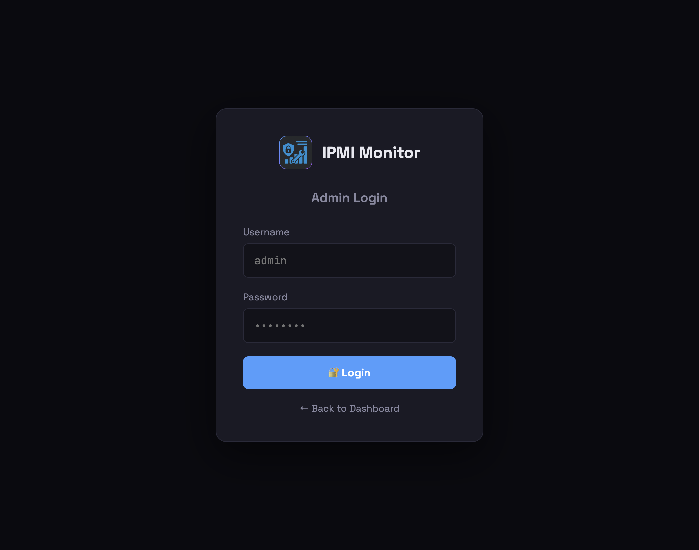

# IPMI Monitor

[](https://github.com/cryptolabsza/ipmi-monitor/actions/workflows/docker-build.yml)
[](https://opensource.org/licenses/MIT)

**Free, self-hosted IPMI/BMC monitoring for your server fleet.** Collect System Event Logs (SEL), monitor sensors, track ECC errors, and get alerts - all from a beautiful web dashboard.



## 📸 Screenshots

<table>
<tr>
<td><br/><em>Event Log - Track SEL events</em></td>
<td><br/><em>Live Sensors - Temperature, fans, voltage</em></td>
</tr>
<tr>
<td><br/><em>Hardware Inventory - CPU, Memory, Storage</em></td>
<td><br/><em>Secure Admin Login</em></td>
</tr>
</table>

## ✨ Features

### 🆓 Free Self-Hosted Features
- 🔍 **Event Collection** - Automatically collect IPMI SEL logs (parallel, 32 workers)
- 📊 **Real-time Dashboard** - Auto-refreshing every second with server status cards
- 🌡️ **Sensor Monitoring** - Temperature, fan, voltage, power readings
- 💾 **ECC Memory Tracking** - Identify which DIMM has errors
- 🎮 **GPU Health Monitoring** - Detect NVIDIA GPU errors via SSH (Xid errors)
- 📜 **SSH System Logs** - Collect dmesg, journalctl, syslog, mcelog via SSH
- 🔧 **Hardware Error Detection** - AER, PCIe, ECC errors parsed automatically
- 🔄 **Uptime & Reboot Detection** - Track unexpected server reboots
- 🚨 **Alert Rules** - Configurable alerts with email, Telegram, webhooks
- ✅ **Alert Resolution** - Notifications when issues are resolved
- ⏱️ **Alert Confirmation** - Threshold checks to avoid false positives
- 📈 **Prometheus Metrics** - Native `/metrics` endpoint for Grafana
- 🔐 **User Management** - Admin and read-only access levels
- 📥 **Full Backup/Restore** - Export everything: servers, credentials, SSH keys, alerts
- 🐳 **Docker Ready** - Multi-arch images (amd64/arm64)
- 🔄 **Version Display** - Shows version, git commit, and build time in header
- ⬆️ **Update Notifications** - Checks GitHub for newer releases
- 🔧 **Bulk Credentials** - Apply SSH/IPMI credentials to multiple servers at once
- 🔃 **BMC Reset** - Cold/warm reset BMC without affecting host OS

### 🤖 Optional AI Features (via CryptoLabs)
- 📊 Daily health summaries with GPU error detection
- 🔧 AI-generated maintenance tasks
- 📈 Failure predictions
- 🔍 Root cause analysis with severity filtering
- 💬 AI chat assistant
- 🤖 **AI Recovery Agent** - Autonomous GPU recovery with escalation
- 🛠️ **Recovery Actions** - Clock limiting, soft resets, coordinated reboots
- 🏢 **Multi-Site Support** - One account, multiple datacenter locations
- 🔗 **Instance Fingerprinting** - Track all installations automatically
- 📋 **Remote Task Queue** - AI service sends tasks, Monitor executes

---

## 🆕 What's New in v0.7.x

### v0.7.8 - SSH System Log Collection
- **Background SSH Log Collection** - Automatically collect dmesg, journalctl, syslog, mcelog
- **System Logs Tab** - View collected logs per server with severity filtering
- **AER/PCIe Error Detection** - Automatically parse and categorize hardware errors
- **GPU Xid Fault Tracking** - Extract NVIDIA Xid errors from kernel logs
- **Parallel Collection** - Up to 8 workers for fast log collection with SSE progress UI
- **AI Integration** - SSH logs synced to AI service for intelligent analysis

### v0.7.7 - AI Safety Agent
- **Input Validation** - Detect prompt injection, code injection, role hijacking
- **Threat Detection** - Block malicious queries before processing
- **Entropy Analysis** - Detect obfuscated attack payloads
- **Secret Redaction** - Automatically redact credentials from AI responses

### v0.7.6 - Post-Event RCA
- **Dark Recovery Investigation** - When a server recovers, AI investigates what happened
- Checks SSH uptime, SEL logs, and concurrent failures to determine root cause
- `/api/server/<bmc_ip>/investigate` endpoint for manual RCA

### v0.7.5 - Agent Task Queue
- AI service can now send tasks to IPMI Monitor for execution
- Remote power cycles, BMC resets, SSH commands
- Automatic task polling and execution

### v0.7.4 - Modular AI Tabs
- Embeddable AI views for iframe integration
- `/embed/summary`, `/embed/chat`, `/embed/rca`, `/embed/agent`

### v0.7.3 - Admin Instance Dashboard
- View all IPMI Monitor instances (free and paid)
- Trial abuse detection via fingerprinting
- Block/unblock instances

### v0.7.2 - All-Instance Telemetry
- Free users now send basic stats for tracking
- No authentication required for telemetry

### v0.7.1 - Instance Fingerprinting
- Unique ID for each IPMI Monitor installation
- Based on public IP, BMC IPs, server names

### v0.7.0 - Multi-Site Support
- One customer can have multiple IPMI Monitor instances at different locations
- Configure site name in Settings → AI tab
- All sites share the same license and billing

---

## 🚀 Quick Start (5 minutes)

### Option 1: Docker Compose (Recommended)

**Step 1:** Create project directory
```bash
mkdir ipmi-monitor && cd ipmi-monitor
```

**Step 2:** Create `docker-compose.yml`:
```yaml
version: '3.8'

services:
  ipmi-monitor:
    image: ghcr.io/cryptolabsza/ipmi-monitor:latest
    container_name: ipmi-monitor
    restart: unless-stopped
    ports:
      - "5000:5000"
    environment:
      - APP_NAME=My Server Fleet        # Customize this
      - IPMI_USER=admin
      - IPMI_PASS=YourIPMIPassword      # Your BMC password
      - ADMIN_PASS=changeme             # CHANGE THIS!
      - SECRET_KEY=change-this-to-random-string
    volumes:
      - ipmi_data:/app/data             # ⚠️ IMPORTANT: Persists your data!

volumes:
  ipmi_data:
```

**Step 3:** Start the service
```bash
docker-compose up -d
```

**Step 4:** Open http://localhost:5000 and add your servers!

---

### Option 2: Docker Run

```bash
# Create a named volume for data persistence
docker volume create ipmi_data

# Run the container
docker run -d \
  --name ipmi-monitor \
  -p 5000:5000 \
  -e IPMI_USER=admin \
  -e IPMI_PASS=YourIPMIPassword \
  -e ADMIN_PASS=YourAdminPassword \
  -e SECRET_KEY=your-random-secret-key \
  -v ipmi_data:/app/data \
  --restart unless-stopped \
  ghcr.io/cryptolabsza/ipmi-monitor:latest
```

---

## 🏢 Multi-Site Deployment

If you have servers in multiple datacenters, deploy an IPMI Monitor instance at each location:

```
Customer: Your Company
├── Site: NYC Datacenter (50 servers)
│   └── IPMI Monitor instance with site_name="NYC Datacenter"
├── Site: London Office (30 servers)
│   └── IPMI Monitor instance with site_name="London Office"
└── Site: Singapore Colo (20 servers)
    └── IPMI Monitor instance with site_name="Singapore Colo"

Total: 100 servers, 1 license, 3 sites
```

### Configuration

1. Install IPMI Monitor at each location
2. Use the **same license key** at all sites
3. Go to **Settings** → **AI** → **Site Configuration**
4. Set a unique **Site Name** for each location
5. All sites share the same billing and appear in your account

---

## ⚠️ Important: Data Persistence

**Always use a named volume** to preserve your data across container updates:

```yaml
# ✅ CORRECT - Named volume (survives updates)
volumes:
  - ipmi_data:/app/data

# ❌ WRONG - No volume (data lost on rebuild)
# (no volume specified)
```

---

## 🔄 Keeping Up to Date

IPMI Monitor is actively developed with regular updates. There are several ways to stay current:

### Option 1: Automatic Updates with Watchtower (Recommended)

[Watchtower](https://containrrr.dev/watchtower/) automatically updates your container when new images are released:

```yaml
version: '3.8'

services:
  ipmi-monitor:
    image: ghcr.io/cryptolabsza/ipmi-monitor:latest
    container_name: ipmi-monitor
    restart: unless-stopped
    ports:
      - "5000:5000"
    environment:
      - IPMI_USER=admin
      - IPMI_PASS=YourIPMIPassword
      - ADMIN_PASS=changeme
      - SECRET_KEY=your-random-secret-key
    volumes:
      - ipmi_data:/app/data
    labels:
      - "com.centurylinklabs.watchtower.enable=true"  # Enable auto-updates

  watchtower:
    image: containrrr/watchtower
    container_name: watchtower
    restart: unless-stopped
    environment:
      - WATCHTOWER_CLEANUP=true              # Remove old images
      - WATCHTOWER_POLL_INTERVAL=300         # Check every 5 minutes
      - WATCHTOWER_LABEL_ENABLE=true         # Only update labeled containers
      - WATCHTOWER_ROLLING_RESTART=true      # Graceful restarts
    volumes:
      - /var/run/docker.sock:/var/run/docker.sock

volumes:
  ipmi_data:
```

**How it works:**
1. Watchtower checks ghcr.io every 5 minutes for new images
2. When a new version is pushed, it automatically:
   - Pulls the new image
   - Stops the running container gracefully
   - Starts a new container with the updated image
   - Cleans up the old image
3. Your data is preserved in the named volume

### Option 2: Manual Update

```bash
# Pull the latest image
docker pull ghcr.io/cryptolabsza/ipmi-monitor:latest

# Recreate the container
docker-compose up -d
```

### Option 3: Check for Updates in the UI

1. Click the version badge in the dashboard header
2. If an update is available, you'll see an "Update Available" notification
3. Follow the displayed `docker pull` command

### Image Tags

| Tag | Description | Use Case |
|-----|-------------|----------|
| `:latest` | Latest stable release | Production |
| `:stable` | Same as :latest | Production |
| `:main` | Main branch builds | Production (bleeding edge) |
| `:dev` | Develop branch builds | Testing new features |
| `:v1.6.0` | Specific version | Pinned deployments |

### Version Check API

```bash
# Check current version
curl http://localhost:5000/api/version

# Check for updates
curl http://localhost:5000/api/version/check
```

---

## 🔧 BMC Reset (New!)

Reset the BMC without affecting the host server:

- **Cold Reset** - Full BMC reboot, clears all state
- **Warm Reset** - Softer restart, preserves some state
- **BMC Info** - Check BMC firmware and status

Available in Server Detail → Power Control dropdown.

```bash
# Manual BMC reset via ipmitool
ipmitool -I lanplus -H 192.168.1.100 -U admin -P password mc reset cold
```

---

## 🚨 Alert Features

### Alert Confirmation Threshold

Prevent false positives from transient issues:

- **Confirm After X checks** - Only fire alert after X consecutive failures
- Default: 3 checks for "Server Unreachable" alerts
- Configurable per alert rule

### Alert Resolution Notifications

Get notified when issues are resolved:

- **Auto-resolution** - Alerts auto-resolve when condition clears
- **Notify on Resolve** - Toggle per alert rule
- Resolution notifications include duration

---

## ⚙️ Configuration

### Environment Variables

| Variable | Default | Description |
|----------|---------|-------------|
| `APP_NAME` | IPMI Monitor | Displayed in header |
| `IPMI_USER` | admin | Default BMC username |
| `IPMI_PASS` | (required) | Default BMC password |
| `ADMIN_USER` | admin | Dashboard admin username |
| `ADMIN_PASS` | changeme | Dashboard admin password |
| `SECRET_KEY` | (auto) | Flask session secret (**set this!**) |
| `POLL_INTERVAL` | 300 | Seconds between collections |
| `DATA_RETENTION_DAYS` | 30 | How long to keep events |

---

## 🤖 AI Features (Optional)

Upgrade your monitoring with AI-powered insights from CryptoLabs:

| Feature | Description |
|---------|-------------|
| 📊 **Daily Summaries** | AI analyzes your fleet health daily with GPU focus |
| 🔧 **Maintenance Tasks** | Auto-generated from events |
| 📈 **Predictions** | Failure warnings before they happen |
| 🔍 **Root Cause Analysis** | AI explains what went wrong with severity filtering |
| 💬 **Chat** | Ask questions about your servers |
| 🏢 **Multi-Site** | Aggregate all your sites under one account |
| 🤖 **Agent Task Queue** | AI sends recovery tasks for execution |
| 🔍 **Post-Event RCA** | Investigate what happened during downtime |

### Enable AI

1. Go to **Settings** → **AI Features**
2. Click **Start Free Trial** (1 month free!)
3. Create account or login at CryptoLabs
4. Configure your **Site Name** for multi-site support
5. You're connected!

### Pricing

| Tier | Price | Servers | Tokens/month | Trial |
|------|-------|---------|--------------|-------|
| Free | $0 | Unlimited | - | Basic monitoring only |
| Standard | $100/mo | 50 servers | 1M tokens | 1 month free |
| Standard+ | +$15/10 servers | 51+ | +100K tokens | - |
| Professional | $500/mo | 500 servers | 10M tokens | 1 month free |

> 💡 **Tokens** are used for AI chat, summaries, and predictions. 1M tokens ≈ 2000+ AI queries/month.

---

## 📋 API Reference

### Public Endpoints

| Endpoint | Description |
|----------|-------------|
| `GET /` | Dashboard |
| `GET /api/servers` | List servers |
| `GET /api/events` | Get events (filterable) |
| `GET /api/stats` | Dashboard stats |
| `GET /api/sensors/{bmc_ip}` | Sensor readings |
| `GET /metrics` | Prometheus metrics |
| `GET /health` | Health check |
| `GET /api/version` | Current version info |
| `GET /api/version/check` | Check for updates |

### New v0.7.x Endpoints

| Endpoint | Description |
|----------|-------------|
| `POST /api/server/{bmc_ip}/investigate` | Post-event RCA investigation |
| `POST /api/server/{bmc_ip}/bmc/{action}` | BMC reset (cold/warm/info) |
| `GET /api/recovery/permissions` | Recovery agent permissions |
| `POST /api/alerts/history/{id}/resolve` | Manually resolve alert |

### Admin Endpoints (login required)

| Endpoint | Description |
|----------|-------------|
| `POST /api/collect` | Trigger collection |
| `POST /api/servers/add` | Add server |
| `DELETE /api/servers/{bmc_ip}` | Delete server |
| `PUT /api/ai/config` | Update AI config (including site_name) |
| `GET /api/backup` | Full configuration backup |
| `POST /api/restore` | Restore from backup |

---

## 🔒 Security

IPMI Monitor is designed with security in mind for production datacenter environments:

### Credential Protection
- **No Command-Line Exposure** - IPMI passwords use environment variables (`IPMI_PASSWORD`), not `-P` flags
- **SSH Key Isolation** - SSH private keys stored in temporary files with 0600 permissions
- **Password Masking** - Passwords passed via `SSHPASS` environment variable, not command line
- **No Credential Sync** - Credentials are **never** sent to the AI cloud service

### Data Handling
- **Local-First** - All data stored locally in SQLite, cloud sync is optional
- **Minimal Cloud Data** - Only events, sensors, inventory, and logs synced (no credentials)
- **Secret Redaction** - AI responses automatically redact any detected credentials

### Access Control
- **Role-Based Access** - Admin vs read-only user levels
- **Session Management** - Secure Flask sessions with configurable secret key
- **API Authentication** - Protected endpoints require authentication

### AI Safety (Optional)
- **Input Validation** - SafetyAgent detects prompt injection and code injection
- **Threat Blocking** - Malicious queries blocked before reaching LLM
- **Output Filtering** - Secret redaction prevents accidental credential exposure

### Best Practices
```yaml
environment:
  - SECRET_KEY=your-random-32-char-key  # Always set this!
  - ADMIN_PASS=strong-unique-password   # Change from default
```

---

## 🛠️ Developer Guide

See [DEVELOPER_GUIDE.md](docs/DEVELOPER_GUIDE.md) for:

- Git workflow (develop/main branches)
- Release process
- Docker tag conventions
- CI/CD pipeline details

---

## 🤝 Contributing

1. Fork the repository
2. Create feature branch (`git checkout -b feature/amazing`)
3. Commit changes (`git commit -m 'Add amazing feature'`)
4. Push to branch (`git push origin feature/amazing`)
5. Open a Pull Request

---

## 📜 License

MIT License - see [LICENSE](LICENSE) for details.

---

## 🔗 Links

- **GitHub**: [github.com/cryptolabsza/ipmi-monitor](https://github.com/cryptolabsza/ipmi-monitor)
- **Docker Image**: [ghcr.io/cryptolabsza/ipmi-monitor](https://ghcr.io/cryptolabsza/ipmi-monitor)
- **AI Features**: [cryptolabs.co.za/ipmi-monitor](https://cryptolabs.co.za/ipmi-monitor)
- **Documentation**: [cryptolabsza.github.io/ipmi-monitor](https://cryptolabsza.github.io/ipmi-monitor)
- **Support**: [CryptoLabs Discord](https://discord.gg/cryptolabs)

---

<p align="center">
  Made with ❤️ by <a href="https://cryptolabs.co.za">CryptoLabs</a>
</p>
