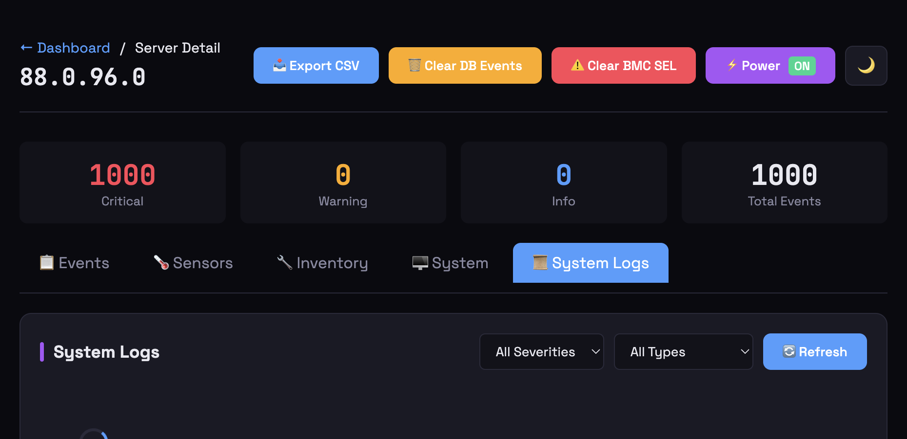

# IPMI Monitor

**Free, self-hosted IPMI/BMC monitoring for your server fleet.**

[](https://github.com/cryptolabsza/ipmi-monitor)
[](https://github.com/cryptolabsza/ipmi-monitor/actions/workflows/docker-build.yml)
[](https://opensource.org/licenses/MIT)

Collect System Event Logs (SEL), monitor sensors, track ECC errors, gather SSH system logs, and get alerts — all from a beautiful web dashboard.

---

## 📖 Documentation

| Guide | Description |
|-------|-------------|
| [User Guide](user-guide.html) | Complete documentation for using IPMI Monitor |
| [IPMI SEL Reference](IPMI_SEL_REFERENCE.html) | Decode BMC event logs and troubleshoot hardware issues |
| [Developer Guide](DEVELOPER_GUIDE.html) | Git workflow, releases, CI/CD |

---

## 🚀 Quick Start (v1.1.0)

### One Command Setup (Recommended)

```bash
# Install the CLI tool
sudo apt install pipx -y
pipx install ipmi-monitor

# Run the quickstart wizard (use full path since pipx bin isn't in sudo PATH)
sudo ~/.local/bin/ipmi-monitor quickstart
```

**That's it!** The wizard will:
- ✅ Detect or manually add your servers
- ✅ Configure IPMI and SSH credentials  
- ✅ Deploy Docker containers (ipmi-monitor + nginx + watchtower)
- ✅ Set up SSL with Let's Encrypt (optional)
- ✅ Enable automatic updates via Watchtower

### Docker Run (Alternative)

```bash
docker run -d \
  --name ipmi-monitor \
  -p 5000:5000 \
  -v ipmi_data:/app/data \
  -e IPMI_USER=admin \
  -e IPMI_PASS=YourBMCPassword \
  -e ADMIN_PASS=YourAdminPassword \
  -e SECRET_KEY=your-random-secret-key \
  ghcr.io/cryptolabsza/ipmi-monitor:latest
```

Then open **http://localhost:5000** and add your servers!

See [User Guide](user-guide.md#quick-start) for Docker Compose setup.

---

## 💻 CLI Commands

After installation, use the `ipmi-monitor` CLI:

| Command | Description |
|---------|-------------|
| `sudo ipmi-monitor quickstart` | ⚡ One-command Docker deployment (recommended) |
| `ipmi-monitor status` | Show container status |
| `ipmi-monitor logs [-f]` | View container logs |
| `ipmi-monitor start` | Start containers |
| `ipmi-monitor stop` | Stop containers |
| `ipmi-monitor restart` | Restart containers |
| `ipmi-monitor upgrade` | Pull latest image & restart |
| `ipmi-monitor add-server` | Add a server interactively |
| `ipmi-monitor list-servers` | List configured servers |
| `ipmi-monitor setup-ssl` | Set up HTTPS reverse proxy |
| `ipmi-monitor uninstall` | Uninstall IPMI Monitor (with options) |
| `ipmi-monitor version` | Show detailed version info |
| `ipmi-monitor setup-ssl` | Retry Let's Encrypt SSL setup |

---

## 📸 Screenshots


*Main dashboard showing 39 servers with real-time status*

<table>
<tr>
<td><br/><em>Event Log - SEL events</em></td>
<td><br/><em>Live Sensors</em></td>
</tr>
<tr>
<td><br/><em>Hardware Inventory</em></td>
<td><br/><em>SSH System Logs</em></td>
</tr>
</table>

---

## ✨ Features

### 🆓 Free Self-Hosted

| Feature | Description |
|---------|-------------|
| 🔍 **SEL Collection** | Parallel IPMI event collection (32 workers) |
| 📊 **Real-time Dashboard** | Auto-refreshing server status cards |
| 🌡️ **Sensor Monitoring** | Temperature, fan, voltage, power readings |
| 💾 **ECC Tracking** | Identify which DIMM has memory errors |
| 🎮 **GPU Health** | Detect NVIDIA Xid errors via SSH |
| 📜 **SSH System Logs** | Collect dmesg, journalctl, syslog, mcelog |
| 🔧 **Hardware Errors** | AER, PCIe, ECC errors parsed automatically |
| 🚨 **Alerts** | Email, Telegram, webhook notifications |
| ✅ **Alert Resolution** | Notify when issues clear |
| 📈 **Prometheus** | Native `/metrics` endpoint for Grafana |
| 🔐 **User Management** | Admin and read-only access levels |
| 📥 **Backup/Restore** | Export everything for disaster recovery |
| 🔃 **BMC Reset** | Cold/warm reset without affecting host OS |
| 🐳 **Docker Ready** | Multi-arch images (amd64/arm64) |
| 🔄 **Auto-Updates** | Watchtower keeps containers updated |

### 🆕 What's New in v1.1.0

| Feature | Description |
|---------|-------------|
| 📦 **Quickstart Wizard** | One-command Docker deployment with nginx, SSL, Watchtower |
| 🔐 **SSH Key Auto-Import** | Keys from quickstart auto-imported to database |
| 🌐 **Subpath Routing** | Deploy at `/ipmi/` alongside other services |
| 🔄 **Watchtower Integration** | Automatic container updates every 5 minutes |
| 👤 **Read-Write Role** | New role with settings access but no user management |
| 📥 **Fixed Export/Import** | Alert rules now export/import correctly |
| 🎨 **Fleet Landing Page** | Nginx serves a landing page at `/` linking to services |
| ⚡ **Refresh Buttons** | Server detail page: refresh sensors/events from BMC |
| 🛡️ **Uninstall Options** | Choose to remove containers, config, or both |

### 🤖 AI Features (Optional)

Upgrade with AI-powered insights from [CryptoLabs](https://cryptolabs.co.za):

| Feature | Description |
|---------|-------------|
| 📊 **Daily Summaries** | AI-generated fleet health with GPU focus |
| 🔧 **Maintenance Tasks** | Auto-generated from events |
| 📈 **Predictions** | Failure warnings before they happen |
| 🔍 **Root Cause Analysis** | AI explains what went wrong |
| 💬 **AI Chat** | Ask questions about your servers |
| 🤖 **Recovery Agent** | Autonomous GPU recovery with escalation |
| 🏢 **Multi-Site** | One account, multiple datacenters |
| 📋 **Task Queue** | AI sends recovery tasks for execution |

**Start your free trial:** Settings → AI Features → Start Free Trial

---

## ⚙️ Configuration

| Variable | Default | Description |
|----------|---------|-------------|
| `APP_NAME` | IPMI Monitor | Displayed in header |
| `IPMI_USER` | admin | Default BMC username |
| `IPMI_PASS` | (required) | Default BMC password |
| `ADMIN_PASS` | changeme | Dashboard admin password |
| `SECRET_KEY` | (auto) | Flask session secret (**set this!**) |
| `POLL_INTERVAL` | 300 | Seconds between collections |
| `SSH_LOG_INTERVAL` | (disabled) | Minutes between SSH log collection |

---

## 🔒 Security

IPMI Monitor is designed for production datacenter environments:

- **No Command-Line Exposure** - Passwords via environment variables
- **SSH Key Isolation** - Private keys in temporary files with 0600 permissions
- **No Credential Sync** - Credentials **never** sent to AI cloud
- **Local-First** - All data stored locally, cloud sync optional
- **Secret Redaction** - AI responses automatically mask credentials

---

## 🏗️ Architecture

IPMI Monitor runs as a Docker container with an optional nginx reverse proxy:

```
┌─────────────────────────────────────────────────────────────┐
│                    Your Server                              │
│  ┌───────────────────────────────────────────────────────┐  │
│  │ nginx (optional)           Port 443 (HTTPS)           │  │
│  │  ├── /          → Landing page                        │  │
│  │  └── /ipmi/     → IPMI Monitor                        │  │
│  └───────────────────────────────────────────────────────┘  │
│                          │                                   │
│  ┌───────────────────────▼───────────────────────────────┐  │
│  │ ipmi-monitor (Docker)       Port 5000                 │  │
│  │  • Flask web application                              │  │
│  │  • SQLite database (/var/lib/ipmi-monitor/)           │  │
│  │  • Background workers (IPMI polling, SSH collection)  │  │
│  └───────────────────────────────────────────────────────┘  │
│                          │                                   │
│  ┌───────────────────────▼───────────────────────────────┐  │
│  │ watchtower (optional)       Auto-updates              │  │
│  └───────────────────────────────────────────────────────┘  │
└─────────────────────────────────────────────────────────────┘
              │                              │
              ▼                              ▼
    ┌─────────────────┐          ┌─────────────────┐
    │  BMC/IPMI       │          │  Server OS      │
    │  (port 623)     │          │  (SSH port 22)  │
    └─────────────────┘          └─────────────────┘
```

**Live Example:** [dc.cryptolabs.co.za](https://dc.cryptolabs.co.za) - Landing page with IPMI Monitor at `/ipmi/`

---

## 📋 API Reference

IPMI Monitor exposes 150+ REST API endpoints. Here are the most commonly used:

### Dashboard & Events

| Endpoint | Description |
|----------|-------------|
| `GET /` | Web dashboard |
| `GET /api/servers` | List all servers with status |
| `GET /api/events` | Get events (supports filters) |
| `GET /api/stats` | Dashboard statistics |
| `GET /api/maintenance` | Maintenance tasks |
| `GET /api/recovery-logs` | Recovery action history |
| `GET /api/uptime` | Server uptime data |

### Server Management

| Endpoint | Description |
|----------|-------------|
| `GET /api/servers/managed` | All configured servers |
| `POST /api/servers/add` | Add new server |
| `PUT /api/servers/{bmc_ip}` | Update server config |
| `DELETE /api/servers/{bmc_ip}` | Remove server |
| `POST /api/servers/import` | Bulk import servers |
| `GET /api/servers/export` | Export server list |

### Per-Server Operations

| Endpoint | Description |
|----------|-------------|
| `GET /server/{bmc_ip}` | Server detail page |
| `GET /api/server/{bmc_ip}/events` | Server's events |
| `GET /api/sensors/{bmc_ip}` | Live sensor readings |
| `GET /api/server/{bmc_ip}/ssh-logs` | SSH system logs |
| `POST /api/servers/{bmc_ip}/inventory` | Collect inventory |
| `POST /api/server/{bmc_ip}/power/{action}` | Power control (on/off/reset) |
| `POST /api/server/{bmc_ip}/bmc/{action}` | BMC reset (cold/warm) |
| `POST /api/server/{bmc_ip}/investigate` | Post-recovery investigation |

### SSH & Credentials

| Endpoint | Description |
|----------|-------------|
| `GET /api/ssh-keys` | List stored SSH keys |
| `POST /api/ssh-keys` | Add SSH key |
| `POST /api/test/bmc` | Test BMC connection |
| `POST /api/test/ssh` | Test SSH connection |
| `POST /api/ssh-logs/collect-now` | Trigger SSH log collection |

### Alerts & Notifications

| Endpoint | Description |
|----------|-------------|
| `GET /api/alerts/rules` | Alert rules |
| `POST /api/alerts/rules` | Create alert rule |
| `GET /api/alerts/history` | Fired alerts |
| `GET /api/alerts/notifications` | Notification channels |
| `POST /api/alerts/notifications/{type}/test` | Test notification |

### System & Monitoring

| Endpoint | Description |
|----------|-------------|
| `GET /metrics` | Prometheus metrics |
| `GET /health` | Health check |
| `GET /api/version` | Version info |
| `GET /api/version/check` | Check for updates |
| `POST /api/collect` | Trigger IPMI collection |

### AI Features

| Endpoint | Description |
|----------|-------------|
| `GET /api/ai/status` | AI sync status |
| `GET /api/ai/config` | AI configuration |
| `POST /api/ai/sync` | Trigger AI sync |
| `GET /api/ai/results` | Cached AI results |

See [User Guide](user-guide.md#api-reference) for complete endpoint documentation.

---

## 🔗 Links

- **GitHub**: [github.com/cryptolabsza/ipmi-monitor](https://github.com/cryptolabsza/ipmi-monitor)
- **Docker**: [ghcr.io/cryptolabsza/ipmi-monitor](https://ghcr.io/cryptolabsza/ipmi-monitor)
- **Discord**: [Join our Discord](https://discord.gg/7yeHdf5BuC)
- **AI Features**: [cryptolabs.co.za](https://cryptolabs.co.za)

---

## 🆘 Support

- 💬 [Join our Discord](https://discord.gg/7yeHdf5BuC) - Get help, chat with the community
- 🐛 [Report a Bug](https://github.com/cryptolabsza/ipmi-monitor/issues/new)
- 💡 [Request a Feature](https://github.com/cryptolabsza/ipmi-monitor/issues/new)
- 💬 [Discussions](https://github.com/cryptolabsza/ipmi-monitor/discussions)
- 📧 [support@cryptolabs.co.za](mailto:support@cryptolabs.co.za)

---

<p align="center">
  <strong>MIT License</strong> · Made with ❤️ by <a href="https://cryptolabs.co.za">CryptoLabs</a>
</p>
